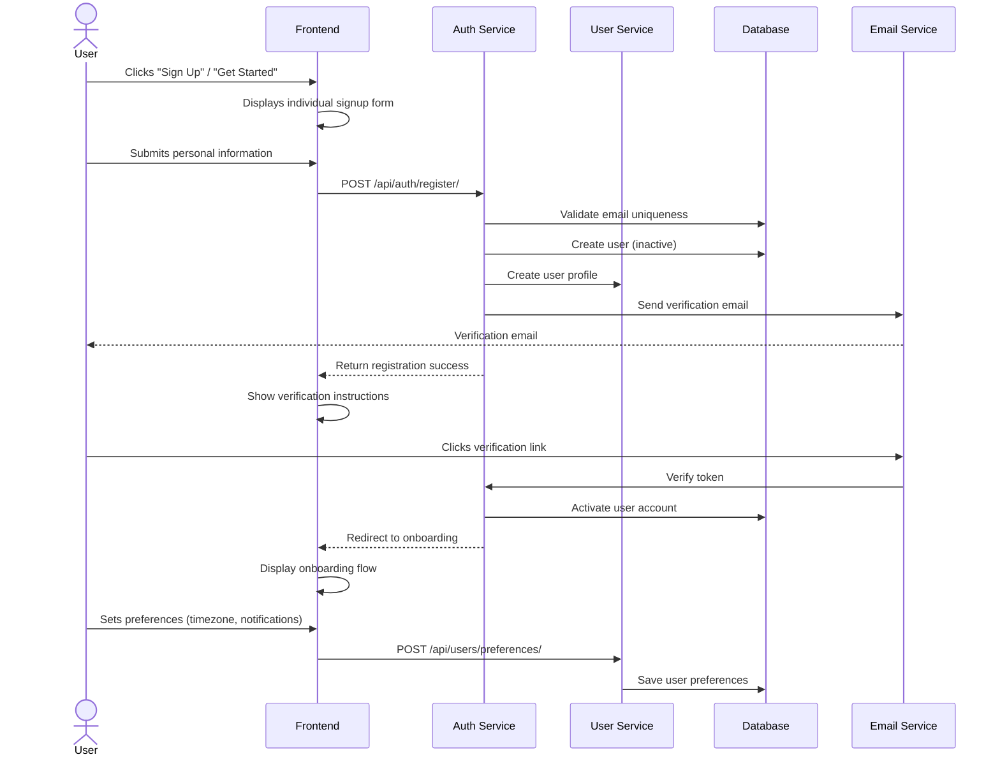

# Architectural Diagrams

## Overview

This document contains architectural diagrams that visualize the key workflows and system interactions within the Stride platform. These diagrams provide a technical and user experience perspective on how different components interact, helping both developers and designers understand the overall architecture.

## Signup & Onboarding Flows

### Individual Signup Flow
